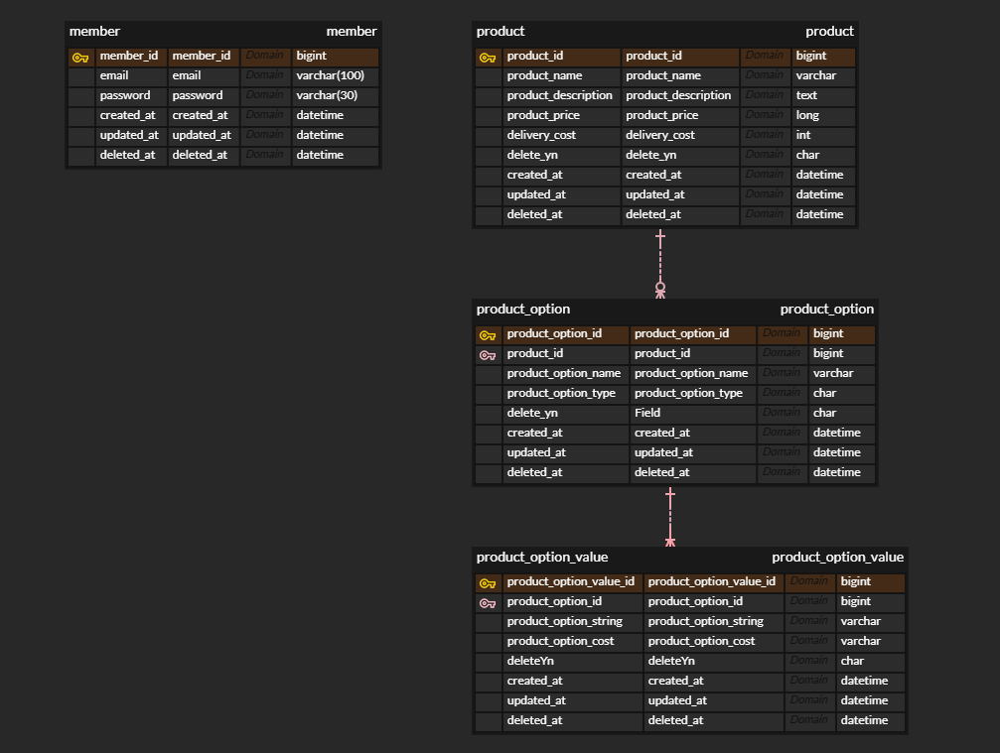

송성근

### 요구사항 분석 및 고려 사항
1. 로그인
- 이메일과 비밀번호를 사용하여 로그인 해야 한다.
- 로그인에 성공하면 JWT 토큰을 발급받는다.
- 이후 모든 API는 JWT 인증이 되어야 한다.
2. 회원가입
- 로그인을 하기위해 회원가입을 한다.
- 이메일과 비밀번호로 회원가입을 진행한다.
3. 상품 관리
- 상품을 등록한다.
  - 상품 PK
  - 상품 이름
  - 상품 설명
  - 가격
  - 배송비
  - 삭제여부
  - 등록일
  - 수정일
  - 삭제일
- 상품 목록을 조회한다.
  - 페이징이 되어야 한다.
  - 삭제된 상품은 조회되지 않는다.
- 상품 상세 조회를 한다.
  - 향후 있을 상품 옵션까지 모두 조회되어야 한다.
  - 삭제된 상품은 조회되지 않는다.
- 상품을 수정한다.
  - 상품 자체만 수정하거나 옵션까지 모두 수정할 수 있다.
- 상품을 삭제한다.
  - 하드 delete가 아닌 소프트 delete로 DB에 delete_yn = Y만 진행한다.
  - 상품, 상품 옵션, 상품 옵션 값 모두 삭제처리 한다.
4. 상품 옵션 관리
- 상품 옵션 등록
  - 상품 옵션을 등록한다.
    - 상품 옵션 PK
    - 상품 PK (relation 용 id 값, FK X, index 적용)
    - 상품 옵션 이름
    - 상품 옵션 타입
      - 입력 타입(CUSTOM)
      - 선택 타입(CHOICE)
    - 삭제여부
    - 등록일
    - 수정일
    - 삭제일
  - 선택 타입의 경우 옵션 값이 RDB에서는 한 컬럼 안에 배열로 들어가는것은 좋지 않으므로 정규화 진행
  - 상품 옵션이 등록될 때 반드시 옵션 값도 존재 해야 한다.
- 상품 옵션 리스트 조회
  - 상품 옵션리스트를 조회한다.
  - 삭제된 상품 및 삭제된 옵션 리스트들은 조회되지 않는다.
  - 개별로 조회될 경우는 없다고 생각해서 한 상품에 대한 옵션 리스트를 조회한다.
- 상품 옵션 수정
  - 상품 옵션을 수정한다.
  - 상품 옵션만 수정하거나 값까지 모두 수정할 수 있다.
- 상품 옵션 삭제
  - 상품 옵션을 삭제한다.
  - 상품 옵션, 상품 옵션에 딸린 상품 옵션 값 모두 삭제한다.
5. 상품 옵션 값
- 상품 옵션 값
  - 상품 옵션 값 PK
  - 상품 옵션 PK (relation 용 id 값, FK X, index 적용)
  - 상품 옵션 문자열
  - 상품 옵션 추가 금액
  - 삭제 여부
  - 등록일
  - 수정일
  - 삭제일
- 해당 상품 옵션 값은 상품 옵션에 종속된다.
- 삭제된 옵션 값들은 조회되지 않는다.

## ERD


## 기술 스택
- Java 23
- Spring Boot 3.5.0
- DB : H2
- ORM : JPA

## API 목록
```
회원 가입
POST /members/signUp
로그인
POST /login

상품 등록
POST /products
상품 조회(페이징)
GET /products?page=&size=
상품 수정
PATCH /products
상품 삭제
DELETE /products/{productId}

상품 옵션 등록
POST /products/productOption
상품 옵션 조회
GET /products/{productId}/productOption
상품 옵션 수정
PATCH /products/productOption
상품 옵션 삭제
DELETE /products/{productId}/productOption/{productOptionId}
```

## 추가 고려 사항
```
회원 가입, 로그인은 security 필터 제외한다.
이외 모든 API는 security 필터에서 jwt검증을 거쳐야 한다.
클린 아키텍쳐를 적용하여 레이어간 의존성을 약하게 한다.
interfaces
   -> contoller
application
   -> useCase
domain
   -> entity, service, repository
infrastructure
   -> jpaRepository
   
레이어간 모두 별도의 dto를 사용한다.
request, criteria, command는 모두 입력값에 대해 검증한다.

클린 아키텍쳐에 따르면 domain에서도 별도의 domainEntity 사용과 infrastructure에서 jpaEntity를 사용해야 하지만,
JPA의 dirtyCheck를 이용한 수정을 포기해야 하고 비즈니스 로직이 infrastucture단까지 가기 때문에 domain에 jpaEntity를 사용하기로 결정했다.

Slf4j를 사용해 로깅한다.
TraceIdFilter를 적용하여 
                        [traceId ]
2025-06-04 07:30:42.277 [4bfc7eae] INFO  [http-nio-8080-exec-1] i.p.i.member.MemberController - interfaces MemberController [POST] /members/signUp payload: SignUpRequestDto[email=test@test.com, password=password]
와 같은 형태로 흐름을 추적한다.

CustomExceptionHandler를 사용하여 에러처리를 진행한다.
```

## 아키텍쳐
```
interfaces/
   member/
      LoginController
      MemberController
      MemberInterfacesDto
      MemberInterfacesDtoMapper
   product/
      ProductController
      ProductInterfacesDto
      ProductInterfacesDtoMapper
application/
   member/
      dto/
         MemberApplicationDto
         MemberApplicationDtoMapper
      MemberUseCase
   product/
      dto/
         ProductApplicationDto
         ProductApplicationDtoMapper
         ProductOptionApplicationDto
         ProductOptionApplicationDtoMapper
      ProductUseCase
      ProductOptionUseCase
domain/
   member/
      entity/
         Member
      service/
         MemberService
      repository/
         MemberRepository
      dto/
         MemberDomainDto
   product/
      entity/
         Product
         ProductOption
         ProductOptionValue
         ProductOptionType
      service/
         ProductService
         ProductOptionService
         ProductOptionValueService
      repository/
         ProductRepository
         ProductOptionRepository
         ProductOptionValueRepository
      dto/
         ProductDomainDto
         ProductOptionDomainDto
         ProductOptionValueDomainDto
infrastructure/
   member/
      jpa/
         MemberJpaRepository
      repositoryImpl/
         MemberRepositryImpl
   product/
      jpa/
         ProductJpaRepository
         ProductOptionJpaRepository
         ProductOptionValueJpaRepository
      repositoryImpl/
         ProductRepositoryImpl
         ProductOptionRepositoryImpl
         ProductOptionValueRepositoryImpl
   ResponseDto
   ResponseCode
common/
   exception/
      CustomExceptionHandler
      ResponseBody
   filter/
      TraceIdFilter
   security/
      jwt/
         JwtAuthenticationFilter
         JwtTokenProvider
      SecurityConfig

```

